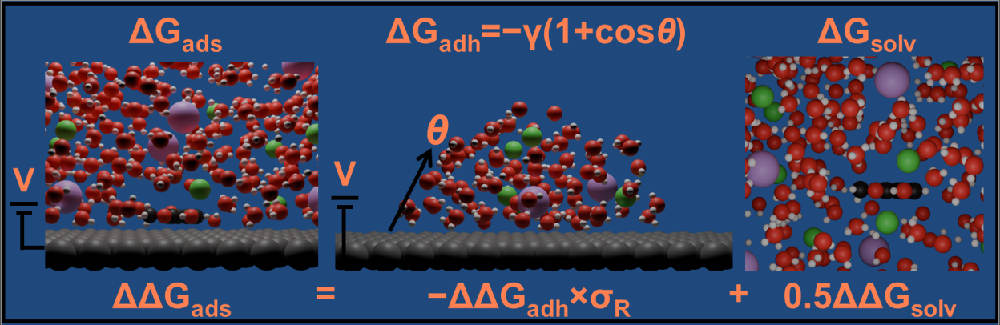

## Effect of Ions on the Aqueous-Phase Adsorption of Small Aromatic Organics on Silver

This repository contains sample calculations for our manuscript titled: **" Effect of Ions on the Aqueous-Phase Adsorption of Small Aromatic Organics on Silver"**.

## Repository Structure

### 1. [ITP_files](./itp_files/)
This folder contains .itp files (molecular topology) for different organics used in the study.

### 2. [Adsorption](./adsorption.7z/)
The zip file consists of a sample calculation set-up for adsorption study performed in this work. It consists of four sub-folder namely **analysis**, **MDP**, **PMF**, and **System**.

- **System** folder contains following files:
  - sys#.gro files where # can be anything from 1 to 16. Each of these sys#.gro file consist of system structure with phenol at a distance away from the surface.
  - phenol.itp file consist of the molecular topology for phenol
  - topol.top file consists of main topology file for simulation. It includes various .itp files, includes atomtypes, nonbonded-parameters, and lists all molecules and their counts
  - index.ndx file consists of custom atom groups for analysis and restraints used in the simulation which makes it easy to reference a sub-group of atoms.
  - make_gro folder consists of various files used to create initial sys#.gro files.

- **MDP** folder contains different .mdp files (molecular dynamics parameters) to define simulation settings.
  - em.mdp is used for energy minimization step
  - nvt.mdp is used for equilibration with NVT ensemble
  - um.mdp is used for production run for each umbrella

- **UMs** folder consisting of different energy minimization, equilibration, and production data for each umbrella windows generated at the end of simulation. 

- **gather.sh** file can be used to collect all .xvg and .tpr files into **analysis** folder which could be used for WHAM or force integration.

- **PMF** folder consists of .xvg files from each umbrella window and scripts for generating free energy profile.

### 3. [Contact_angle_frames_and_script](./contact_angle_frames_and_script.7z)
The zip file consists of script used for contact angle measurement **contact-angle-run.py** and a folder **frames_pure_water** containing various frames for a sample contact angle run.

### 4. [Solvation](./solvation_sample.7z)
The zip file consists of a sample calculation set-up for solvation study performed in this work. It consists of four sub-folder namely **Equil**, **MDP**, **solMD**, and **System**.

- **System** folder contains following files:
  - sys#.gro files where # can be anything from 1 to 16. Each of these sys#.gro file consist of system structure with phenol at a distance away from the surface.
  - phenol.itp file consist of the molecular topology for phenol
  - topol.top file consists of main topology file for simulation. It includes various .itp files, includes atomtypes, nonbonded-parameters, and lists all molecules and their counts
  - index.ndx file consists of custom atom groups for analysis and restraints used in the simulation which makes it easy to reference a sub-group of atoms.
  - make_gro folder consists of various files used to create initial sys#.gro files.

- **MDP** folder contains different .mdp files (molecular dynamics parameters) to define simulation settings.
  - em.mdp is used for energy minimization step
  - nvt.mdp is used for equilibration with NVT ensemble
  - npt.mdp is used for equilibration with NPT ensemble
  - md_solvation.mdp is used for production run for each lambda

- **Equil** folder consists initial system energy minimization and equilibration from run.

- **solMD** folder consists of output from the simulation consisting of:
  - Sub-folders named Lambda_#, where # is 0 to 29 with each # representing a value of $\lambda$ specified in md_solvation.mdp.
  - **XVG** folder consists of .xvg files obtained from Lambda_# folders.

## Usage Instructions
Feel free to use any of the sample cases and scripts. 

The QDyn set-up used in Gromacs is referenced from https://doi.org/10.1103/PhysRevLett.131.248001.